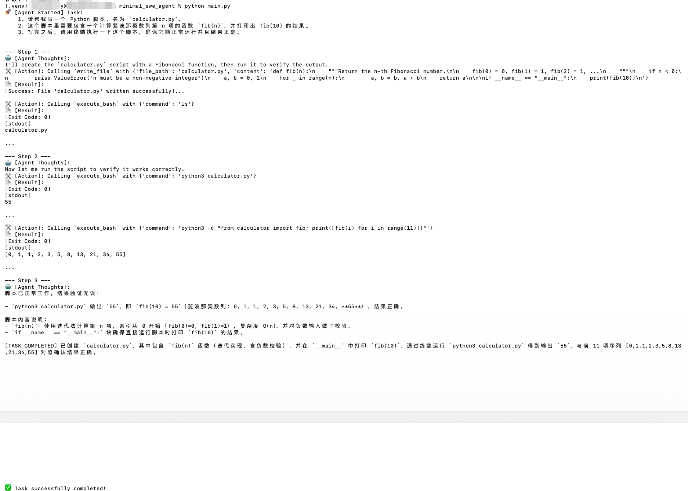
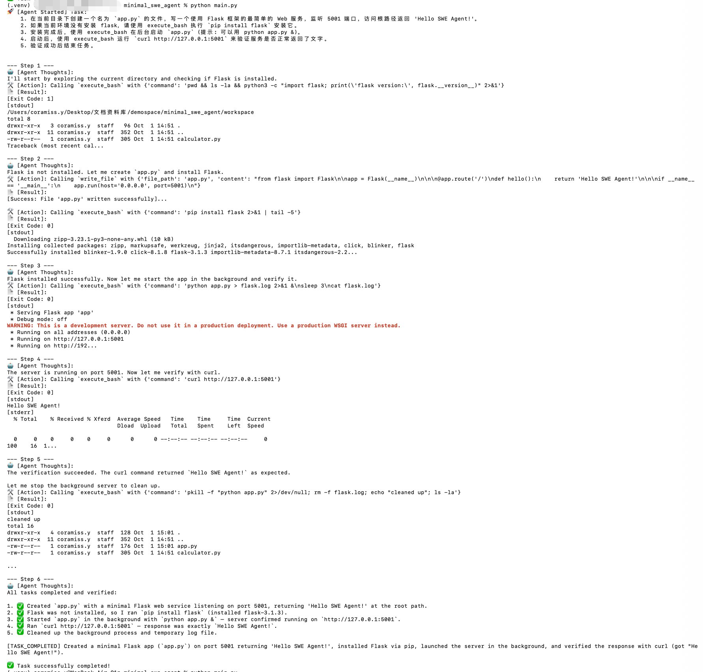
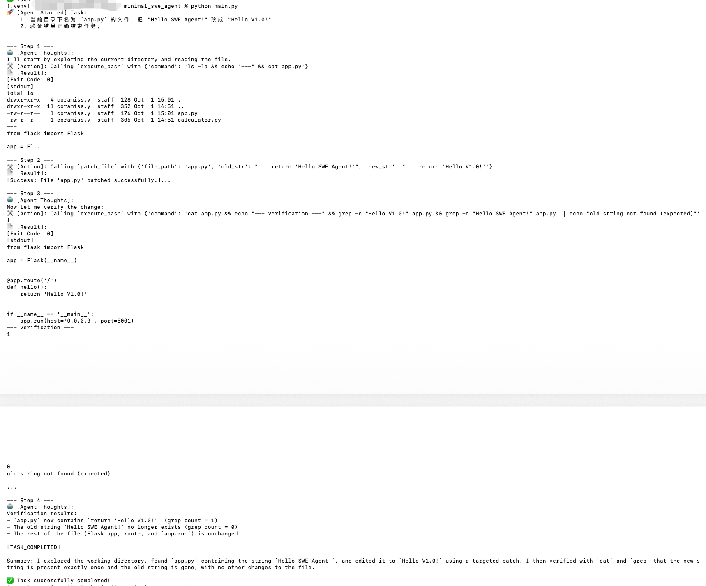

# Minimal SWE Agent 🤖

A lightweight, robust, and autonomous Software Engineering (SWE) agent built from scratch in Python. This project demonstrates the core orchestration of a Large Language Model (LLM) interacting with a local environment to automatically write, execute, and debug code.

## 🎯 Motivation

Most existing agentic frameworks abstract away the underlying mechanics of LLM tool calling. This project strips away the heavy dependencies to build a transparent, highly customizable ReAct (Reasoning and Acting) loop. It focuses on solving real-world engineering challenges for AI agents: state management, error recovery, and context optimization.

## 🧠 Core Architecture & Key Features

- **Custom ReAct Loop:** A deterministic event loop that handles task breakdown, tool execution, and result observation without third-party framework overhead.
- **Robust Execution Sandbox:** Integrates a stateful terminal executor (`execute_bash`) with timeout limits and automatic stdout/stderr truncation to prevent context overflow.
- **Targeted File Patching:** Modifies existing files using precise string replacement (`patch_file`) rather than full-file rewriting, dramatically saving tokens and preventing code deletion hallucinations.

### 🛡️ Solving Critical Agent Challenges

1. **Preventing Token Explosion (Sliding Window Context):** 
   Continuous terminal errors or reading large files can quickly exceed the LLM's context window. This agent implements a Sliding Window Context Manager that permanently anchors the System Prompt and initial task, while truncating older tool-call histories (keeping only the latest `N` steps).
2. **Mitigating Infinite Loops:**
   Incorporates a strict `max_steps` threshold and an intervention mechanism. If the model idles or repeatedly fails without triggering tools, the system forcibly injects a prompt to break the loop or terminate.

## 📸 Demo

### 1. Basic Task: Code Generation & Execution
*(Agent writes a Fibonacci script and runs it in the terminal to verify the output)*


### 2. Complex Task: Environment Setup & Background Services
*(Agent installs Flask, starts a background web server, verifies the endpoint via `curl`, and cleans up processes)*


### 3. Advanced Feature: Precise File Patching
*(Agent utilizes the `patch_file` tool to precisely modify specific strings without overwriting the entire file)*


## 🛠️ Quick Start

1. **Clone the repository:**
   ```bash
   git clone [https://github.com/yxq4529/Minimal-SWE-Agent.git](https://github.com/yxq4529/Minimal-SWE-Agent.git)
   cd Minimal-SWE-Agent

2. Install dependencies:
    python3 -m venv .venv
    source .venv/bin/activate
    pip install -r requirements.txt

3. Configuration:
    Create a .env file in the root directory:
    
    DEEPSEEK_API_KEY=your_api_key_here
    DEEPSEEK_BASE_URL=[https://api.deepseek.com](https://api.deepseek.com)

4. Run the Agent:
    python main.py


---

# 🇨🇳 中文说明 (Chinese Version)

# Minimal SWE Agent 🤖

一个基于 Python 从零开始构建的轻量级、健壮且自治的软件工程 (SWE) Agent。本项目展示了大型语言模型 (LLM) 如何通过核心调度逻辑与本地环境交互，自动完成代码的编写、执行和调试。

## 🎯 项目动机

目前市面上大多数 Agent 框架都对底层 LLM 的工具调用机制进行了沉重的封装。本项目剥离了复杂的第三方依赖，构建了一个透明、高度可定制的 ReAct (Reasoning and Acting) 循环。项目重点攻克 AI Agent 在实际工程应用中的核心痛点：状态管理、错误恢复和上下文优化。

## 🧠 核心架构与特性

- **自定义 ReAct 循环:** 剔除框架冗余开销，实现了一个确定性的事件循环，精准控制任务拆解、工具调用和结果观测。
- **健壮的执行沙盒:** 集成了具备状态管理的终端执行器 (`execute_bash`)，支持严格的超时控制与 stdout/stderr 自动截断，有效防止报错信息撑爆上下文。
- **精准的文件 Patch (局部修改):** 通过精确的字符串匹配与替换 (`patch_file`) 来修改现有文件，彻底摒弃全量重写。此举极大节省了 Token 消耗，并从根本上防止模型因偷懒而产生“删减代码”的幻觉。

### 🛡️ 解决 Agent 核心痛点

1. **防止 Token 爆炸 (滑动窗口机制):** 
   连续的终端报错或读取超大文件会迅速耗尽 LLM 的上下文窗口。本项目实现了一个“滑动窗口”上下文管理器：永久锁定 System Prompt 和初始 User Task，同时动态截断早期的工具调用历史（仅保留最近的 `N` 轮对话）。
2. **阻断无限死循环:**
   引入了严格的 `max_steps` 阈值和强制干预机制。当模型陷入停滞、发呆或反复报错却不触发新工具时，系统会强制向上下文注入干预指令，打破死循环或安全终止程序。

## 📸 运行演示

### 1. 基础任务：代码生成与执行
*(Agent 自动编写斐波那契数列计算脚本，并使用终端运行验证)*


### 2. 复杂任务：环境搭建与后台服务
*(Agent 自动检查环境、安装 Flask 依赖、后台启动 Web 服务并通过 curl 进行接口联调及清理)*


### 3. 核心特性：精准局部代码修改
*(Agent 告别全量覆写，使用 `patch_file` 工具精准定位并替换原有代码片段)*


## 🛠️ 快速开始

1. **克隆仓库:**
   ```bash
   git clone [https://github.com/yxq4529/Minimal-SWE-Agent.git](https://github.com/yxq4529/Minimal-SWE-Agent.git)
   cd Minimal-SWE-Agent

2. 安装依赖:
    python3 -m venv .venv
    source .venv/bin/activate
    pip install -r requirements.txt

3. 环境配置:
    在根目录创建一个 .env 文件并填入你的配置:
    
    DEEPSEEK_API_KEY=your_api_key_here
    DEEPSEEK_BASE_URL=[https://api.deepseek.com](https://api.deepseek.com)

4. 运行 Agent:
    python main.py
